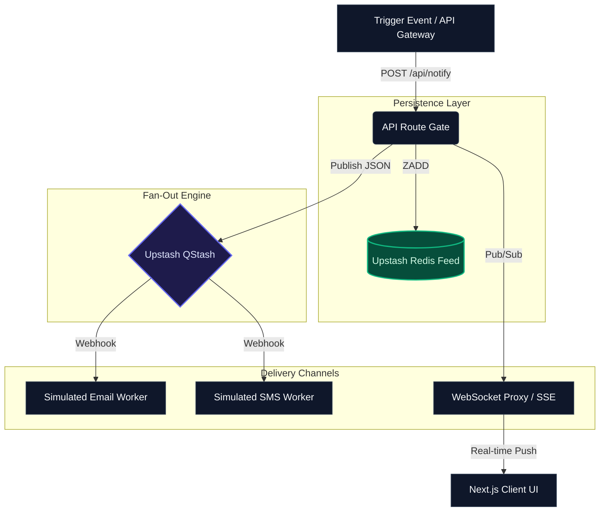

# Next.js Real-Time Notification Engine

A production-ready, event-driven notification system demonstrating distributed systems patterns, real-time client ingestion, state persistence at the edge, and robust client-side resiliency.

---

## 🎯 Architecture Overview

This project serves as a reference implementation for high-throughput, fault-tolerant notification delivery. It decouples event triggering from client delivery using a **Fan-Out Message Queue architecture**, ensuring non-blocking API flows and reliable multi-channel distribution.

### Core Systems Patterns Demonstrated

- **Event-Driven Fan-Out:** Ingestion endpoints immediately offload payloads to serverless message queues for distributed processing across distinct channels (In-App, Email, SMS).
- **Edge State Persistence:** Employs optimized Redis sorted sets (`ZSET`) to maintain chronological feeds with predictable time complexity (`O(log N)`) and auto-pruning.
- **Client-Side Resiliency:** Implements native WebSocket connection managers featuring **Exponential Backoff** algorithms to handle silent disconnects and network drops without overwhelming ingestion gateways upon recovery.
- **Idempotency & Rate Limiting:** Built-in safeguards to prevent duplicate pipeline executions and secure ingestion points against payload abuse.

---

## 🔄 System Flow & Topology



---

## 💻 Tech Stack

- **Frontend Framework:** [Next.js 16](https://nextjs.org/) (App Router) + React 19
- **Styling & UI:** [Tailwind CSS](https://tailwindcss.com/) + [Lucide Icons](https://lucide.dev/)
- **State Persistence:** [Upstash Redis](https://upstash.com/redis) (Serverless Data Layer)
- **Message Queuing:** [Upstash QStash](https://upstash.com/qstash) (Serverless Fan-Out Engine)
- **Real-time Pipeline:** Native WebSockets / Server-Sent Events (SSE)
- **Deployment Target:** [Vercel](https://vercel.com/)

---

### Live Demo [StaffNotify App](https://next-realtime-notifications.vercel.app/)

---

## 🚀 Getting Started

### 1. Clone the Repository

```bash
git clone [https://github.com/yourusername/next-realtime-notifications.git](https://github.com/yourusername/next-realtime-notifications.git)
cd next-realtime-notifications
```

---

## 📄 License

This project is licensed under the MIT License - see the [LICENSE](LICENSE) file for details.

---

_Designed and engineered by [Sumit Yadav](https://ysumit99.github.io/) · [Blog](https://sumityadav-dev.vercel.app) · [LinkedIn](https://www.linkedin.com/in/sumityadav-dev/) · [GitHub](https://github.com/ysumit99/) © 2026_
