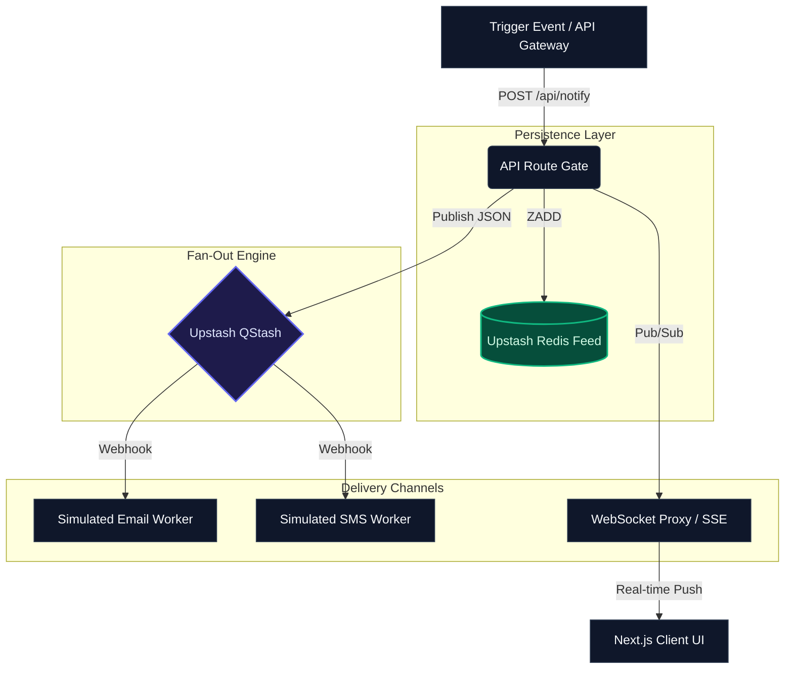

# Next.js Real-Time Notification Engine

A production-ready, event-driven notification system demonstrating distributed systems patterns, asynchronous fan-out delivery, real-time client synchronization, edge persistence, and resilient reconnect handling.

---

## 🎯 Architecture Overview

This project serves as a reference implementation for high-throughput, fault-tolerant notification delivery. It decouples event triggering from client delivery using a **Fan-Out Message Queue architecture**, ensuring non-blocking API flows and reliable multi-channel distribution.

### Core Systems Patterns Demonstrated

- **Event-Driven Fan-Out:** Ingestion endpoints immediately offload payloads to serverless message queues for distributed processing across distinct channels (In-App, Email, SMS).

- **Edge State Persistence:** Employs optimized Redis sorted sets (`ZSET`) to maintain chronological feeds with predictable time complexity (`O(log N)`) and auto-pruning.

- **Client-Side Resiliency:** Implements native WebSocket connection managers featuring **Exponential Backoff** algorithms to handle silent disconnects and network drops without overwhelming ingestion gateways upon recovery.

- **Idempotency & Rate Limiting:** Architectural provisions help prevent duplicate pipeline executions and secure ingestion points against payload abuse.

---

## 🔄 System Flow & Topology



---

## 💻 Tech Stack

- **Frontend Framework:** [Next.js 16](https://nextjs.org/) (App Router) + React 19
- **Language:** TypeScript
- **Styling & UI:** [Tailwind CSS](https://tailwindcss.com/) + [Lucide Icons](https://lucide.dev/)
- **State Persistence:** [Upstash Redis](https://upstash.com/redis) (Serverless Data Layer)
- **Message Queuing:** [Upstash QStash](https://upstash.com/qstash) (Serverless Fan-Out Engine)
- **Real-time Pipeline:** Native WebSockets / Server-Sent Events (SSE)
- **Deployment Target:** [Vercel](https://vercel.com/)

---

## 🌐 Live Demo

[StaffNotify App](https://next-realtime-notifications.vercel.app/)

---

## ✨ Features

- Real-time notification delivery
- Queue-driven asynchronous fan-out processing
- Persistent notification feed using Redis
- WebSocket/SSE client synchronization
- Automatic reconnect with exponential backoff
- Toast-based live notification UI
- Notification unread indicators
- Multi-channel worker simulation architecture
- Serverless-compatible infrastructure
- Edge-ready Redis persistence
- Type-safe TypeScript implementation
- Production-ready scalable design patterns

---

## 🚀 Getting Started

### 1. Clone the Repository

```bash
git clone https://github.com/ysumit99/next-realtime-notifications.git
cd next-realtime-notifications
```

---

### 2. Install Dependencies

Using npm:

```bash
npm install
```

Or using yarn:

```bash
yarn install
```

Or pnpm:

```bash
pnpm install
```

---

### 3. Configure Environment Variables

Create a `.env.local` file in the project root:

```bash
touch .env.local
```

Add the following environment variables:

```env
# Upstash Redis
UPSTASH_REDIS_REST_URL=
UPSTASH_REDIS_REST_TOKEN=

# Upstash QStash
QSTASH_TOKEN=
QSTASH_CURRENT_SIGNING_KEY=
QSTASH_NEXT_SIGNING_KEY=

# Public App URL
NEXT_PUBLIC_APP_URL=http://localhost:3000
```

---

### 4. Set Up Upstash Services

#### Redis Setup

1. Create a Redis database at [Upstash Redis](https://upstash.com/redis)
2. Copy:
   - REST URL
   - REST Token
3. Add them to `.env.local`

---

#### QStash Setup

1. Create a QStash project at [Upstash QStash](https://upstash.com/qstash)
2. Copy:
   - QSTASH_TOKEN
   - Signing Keys
3. Add them to `.env.local`

---

### 5. Run the Development Server

```bash
npm run dev
```

Application will be available at:

```bash
http://localhost:3000
```

---

## 🧪 Testing the Notification Pipeline

### Trigger a Notification

Use the UI dashboard or trigger manually via API:

```bash
curl -X POST http://localhost:3000/api/notify \
  -H "Content-Type: application/json" \
  -d '{
    "title": "Deployment Successful",
    "message": "Production deployment completed successfully.",
    "type": "success"
  }'
```

---

### Expected Flow

1. API route receives notification event
2. Payload persisted into Redis feed
3. Event published to QStash
4. Fan-out workers simulate Email/SMS delivery
5. WebSocket/SSE pipeline pushes live update to connected clients

---

## 🔌 API Endpoints

### POST `/api/notify`

Triggers a new notification event.

#### Request Body

```json
{
  "title": "Deployment Successful",
  "message": "Production deployment completed successfully.",
  "type": "success"
}
```

#### Supported Types

- `success`
- `error`
- `warning`
- `info`

---

## 📁 Project Structure

```bash
.
├── public/                     # Static assets
├── src/
│   ├── app/
│   │   ├── api/
│   │   │   ├── notifications/ # Notification CRUD APIs
│   │   │   │   └── [id]/
│   │   │   ├── notify/        # Notification ingestion endpoint
│   │   │   ├── worker/        # Queue worker simulation routes
│   │   │   │   ├── email/
│   │   │   │   └── sms/
│   │   │   └── ws/            # WebSocket / SSE endpoint
│   │   │
│   │   ├── globals.css
│   │   ├── layout.tsx
│   │   └── page.tsx
│   │
│   ├── components/            # Notification UI components
│   │   ├── ConnectionStatus.tsx
│   │   ├── NotificationBell.tsx
│   │   ├── NotificationFeed.tsx
│   │   ├── NotificationItem.tsx
│   │   └── NotificationToast.tsx
│   │
│   └── lib/
│       ├── redis.ts           # Redis persistence layer
│       ├── types.ts           # Shared TypeScript types
│       └── websocket.ts       # Real-time connection utilities
│
├── README.md
├── next.config.ts
├── tsconfig.json
└── package.json
```

---

## 🧠 Engineering Focus

This project was built to explore:

- Distributed real-time communication patterns
- Stateful event persistence
- Reconnection resiliency strategies
- Event synchronization across clients
- Serverless infrastructure constraints
- Scalable notification system design

---

## 🏗️ Distributed Systems Concepts Explored

- Event-driven architecture
- Queue-driven fan-out message delivery
- Asynchronous worker processing
- Real-time client synchronization
- Redis-backed event persistence
- Fault-tolerant reconnect strategies
- Serverless infrastructure design
- Scalable notification pipelines

---

## ⚡ Key Engineering Highlights

- Event-driven notification architecture
- Queue-based asynchronous fan-out delivery
- Real-time delivery with WebSockets/SSE
- Redis sorted-set feed persistence
- Exponential backoff reconnect strategy
- Serverless-first infrastructure
- Production-ready scalable design patterns
- Type-safe distributed event handling
- Low-latency client synchronization

---

## 🚢 Deployment

The easiest deployment target is Vercel.

### Deploy to Vercel

```bash
vercel
```

Or import the repository directly into:

- [Vercel Dashboard](https://vercel.com/new)

---

### Production Environment Variables

Add the following variables inside your Vercel Project Settings:

```env
UPSTASH_REDIS_REST_URL=
UPSTASH_REDIS_REST_TOKEN=

QSTASH_TOKEN=
QSTASH_CURRENT_SIGNING_KEY=
QSTASH_NEXT_SIGNING_KEY=

NEXT_PUBLIC_APP_URL=https://your-production-domain.vercel.app
```

---

### Redeploy the Application

After adding environment variables:

```bash
vercel --prod
```

---

## 🔐 Environment Notes

This project intentionally uses:

- Stateless serverless architecture
- Queue-driven asynchronous processing
- Redis-backed notification persistence
- Edge-compatible infrastructure patterns
- Lightweight real-time synchronization
- Type-safe distributed communication

Designed for scalability, resiliency, and low-latency real-time delivery.

---

## 🤝 Contributing

Contributions, issues, and feature requests are welcome.

Feel free to fork the repository and submit a pull request.

---

## ⭐ Support

If you found this project useful, consider giving the repository a star on GitHub.

---

## 📄 License

This project is licensed under the MIT License — see the [LICENSE](LICENSE) file for details.

---

_Designed and engineered by [Sumit Yadav](https://ysumit99.github.io/) · [Blog](https://sumityadav-dev.vercel.app) · [LinkedIn](https://www.linkedin.com/in/sumityadav-dev/) · [GitHub](https://github.com/ysumit99/) © 2026_
